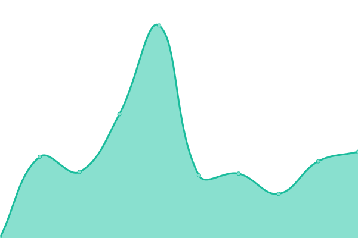
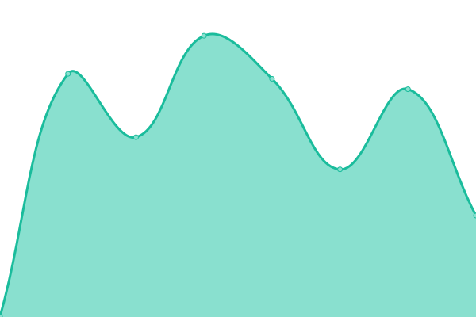

# [📈 Live Status](https://SelrahcD.github.io/uptime): <!--live status--> **🟥 Complete outage**

This repository contains the open-source uptime monitor and status page for [Charles](http://blog.chorip.am), powered by [Upptime](https://github.com/upptime/upptime).

With [Upptime](https://upptime.js.org), you can get your own unlimited and free uptime monitor and status page, powered entirely by a GitHub repository. We use [Issues](https://github.com/SelrahcD/uptime/issues) as incident reports, [Actions](https://github.com/SelrahcD/uptime/actions) as uptime monitors, and [Pages](https://SelrahcD.github.io/uptime) for the status page.

<!--start: status pages-->
<!-- This summary is generated by Upptime (https://github.com/upptime/upptime) -->
<!-- Do not edit this manually, your changes will be overwritten -->
<!-- prettier-ignore -->
| URL | Status | History | Response Time | Uptime |
| --- | ------ | ------- | ------------- | ------ |
|  [🌯 Burritalks](https://www.burritalks.io) | 🟥 Down | [burritalks.yml](https://github.com/SelrahcD/uptime/commits/HEAD/history/burritalks.yml) | 

 618ms
     
 | 

<a href="https://uptime.charlesdesneuf.com/history/burritalks">99.47%</a>
    

|  [📰 Schtroumpsify](https://schtroumpsify.charlesdesneuf.com/) | 🟥 Down | [schtroumpsify.yml](https://github.com/SelrahcD/uptime/commits/HEAD/history/schtroumpsify.yml) | 

 0ms
     
 | 

<a href="https://uptime.charlesdesneuf.com/history/schtroumpsify">100.00%</a>
    

|  [📝 Blog](https://blog.charlesdesneuf.com/) | 🟥 Down | [blog.yml](https://github.com/SelrahcD/uptime/commits/HEAD/history/blog.yml) | 

 401ms
     
 | 

<a href="https://uptime.charlesdesneuf.com/history/blog">99.65%</a>
    

|  [🎩 Personal website](http://www.charlesdesneuf.com/) | 🟥 Down | [personal-website.yml](https://github.com/SelrahcD/uptime/commits/HEAD/history/personal-website.yml) | 

 464ms
     
 | 

<a href="https://uptime.charlesdesneuf.com/history/personal-website">99.80%</a>
    

<!--end: status pages-->

[**Visit our status website →**](https://SelrahcD.github.io/uptime)

## 📄 License

- Powered by: [Upptime](https://github.com/upptime/upptime)
- Code: [MIT](./LICENSE) © [Charles](http://blog.chorip.am)
- Data in the `./history` directory: [Open Database License](https://opendatacommons.org/licenses/odbl/1-0/)
